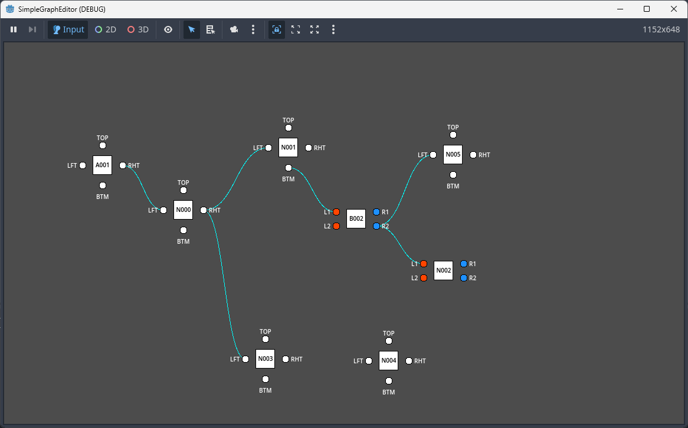

# Simple Graph Editor

[Web Demo](https://robb83.github.io/godot-simple-graph-editor-2d/)

Features:

* Create connection by dragging
* Create node by ending a connection on empty space or double-clicking canvas
* Delete nodes or edges
* Highlight routes
* Editable labels
* Multiple port types: input, output, input-output, multi-connection
 
Keybinding

* Middle mouse button — Pan the canvas by dragging.
* Mouse wheel — Zoom in and out.
* Right-click or Delete key — Remove a node, edge, or port connection.
* Left-click — Start creating a new connection between ports.
* Double-click on node or port — Edit the label.
* Double-click on empty canvas — Create a new random node.

